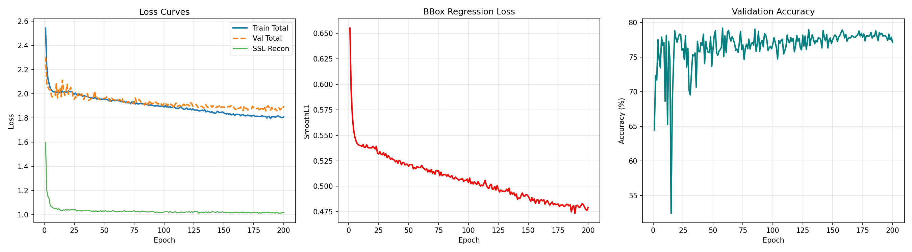
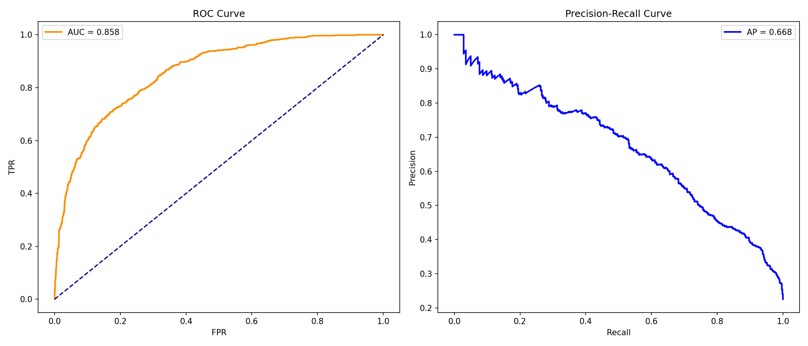
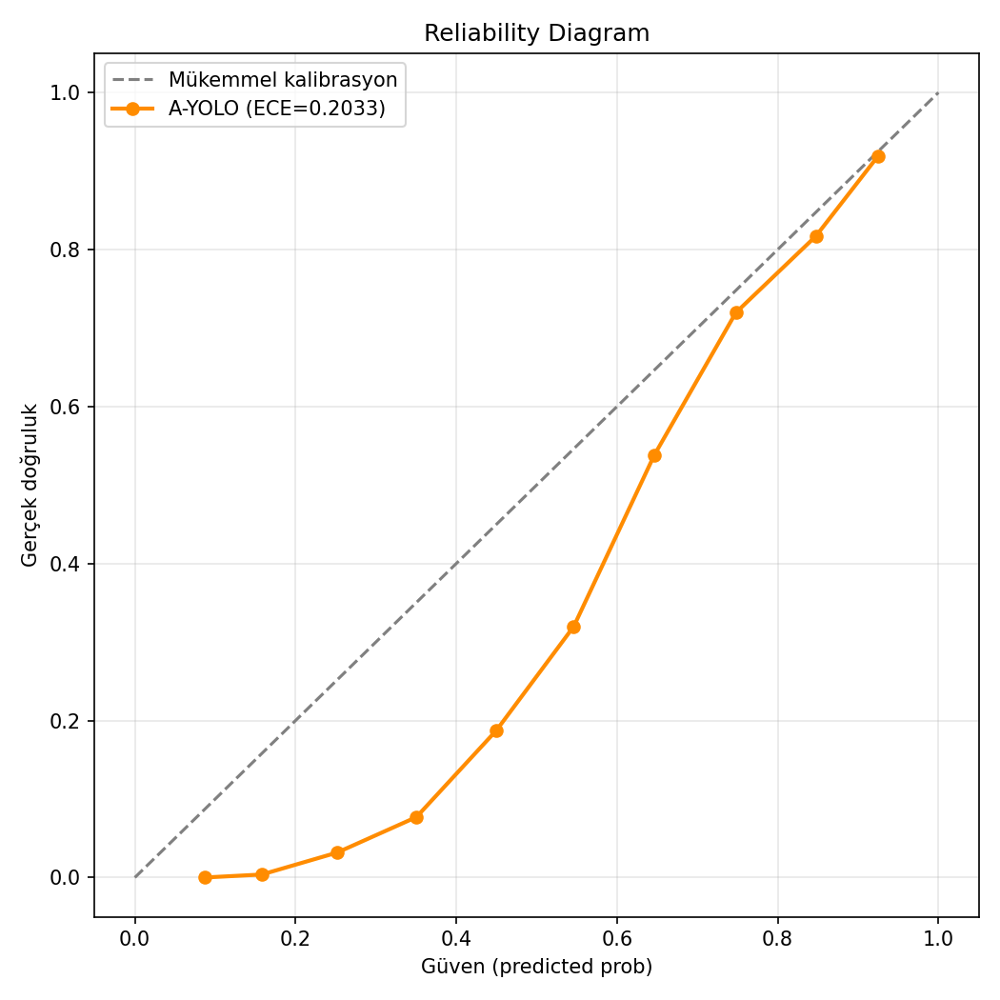
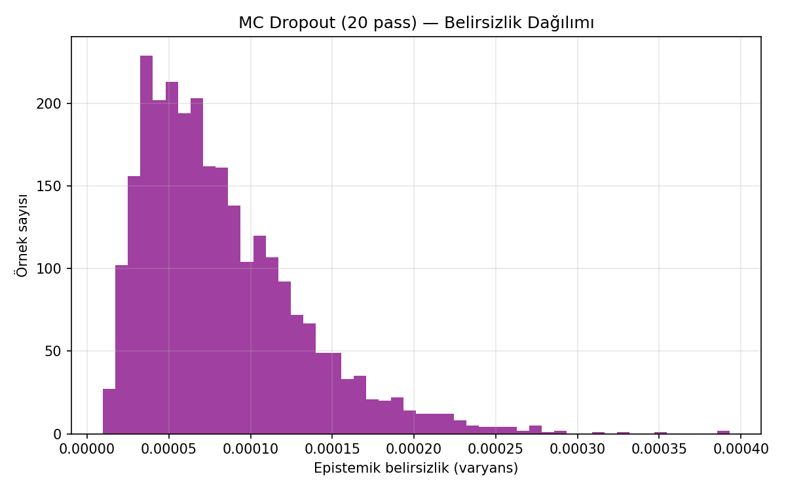
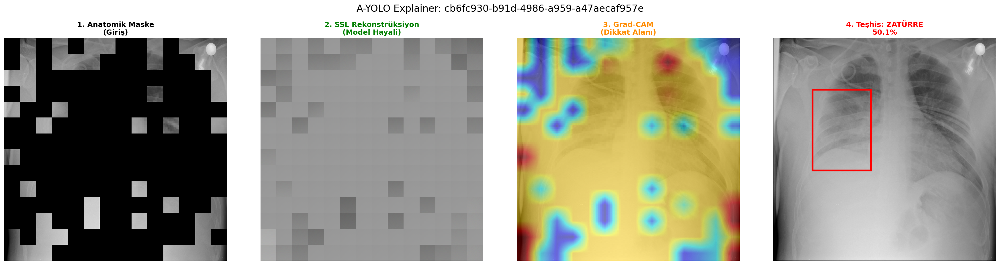
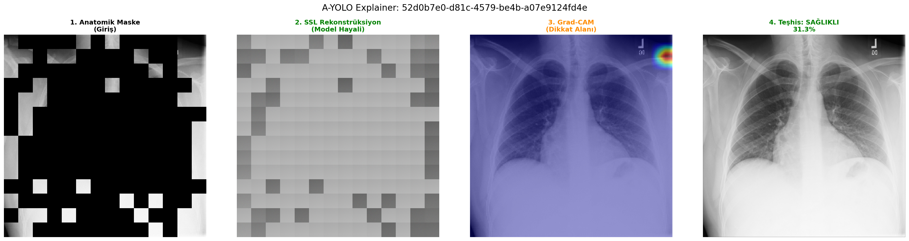
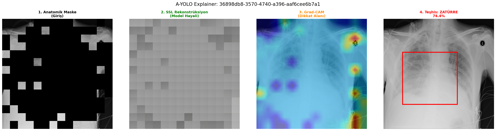

<div align="center">

# 🫁 A-YOLO: Anatomy-Aware Masked YOLO

### Pneumonia Detection on Chest X-Rays via Self-Supervised Anatomical Masking

[](https://www.python.org)
[](https://pytorch.org)
[](https://fastapi.tiangolo.com)
[](https://streamlit.io)
[](LICENSE)
[](https://www.kaggle.com/c/rsna-pneumonia-detection-challenge)

**A hybrid Self-Supervised Learning + Object Detection architecture that learns lung anatomy before localizing pneumonia.**

[Architecture](#-architecture) • [Results](#-results) • [Installation](#-installation) • [Usage](#-usage) • [Deployment](#-deployment) • [Citation](#-citation)

---

</div>

## ✨ HIGHLIGHTS

Standard MAE masks pixels **uniformly at random** — wasteful for medical imaging where information lives in central anatomical regions. **A-YOLO** masks the lungs more densely with a **Gaussian-weighted strategy**, forcing the ViT-Base backbone to reconstruct *clinically relevant* tissue. The same backbone simultaneously trains a YOLO-style detection head, yielding a single model that is both an SSL learner and a pneumonia localizer.

> 🎯 **AUC 0.858** on RSNA test (n=2,668), **outperforming AnatPaste (0.804)** while running at 384×384 — a fraction of the compute of state-of-the-art DETR variants.

---

## 🏗️ Architecture

```
                  ┌──────────────────────────────┐
                  │  Chest X-Ray (224×224 RGB)   │
                  └──────────────┬───────────────┘
                                 │
                  ┌──────────────▼───────────────┐
                  │  ViT-Base/16 Backbone        │
                  │  (ImageNet pretrained)       │
                  └──┬────────────────────────┬──┘
                     │                        │
   ┌─────────────────▼──────┐    ┌────────────▼─────────────┐
   │ 🆕 Anatomy-Aware Mask  │    │  Detection Head          │
   │ (Gaussian-weighted)    │    │  (Decoupled cls + reg)   │
   └─────────────┬──────────┘    └────────────┬─────────────┘
                 │                            │
   ┌─────────────▼──────────┐    ┌────────────▼─────────────┐
   │ MAE Decoder            │    │  Pneumonia: Yes/No       │
   │ (Pixel reconstruction) │    │  BBox: [x, y, w, h]      │
   └────────────────────────┘    └──────────────────────────┘

   ┌────────────── Joint Loss ───────────────┐
   │  L_total = α·L_recon + (1−α)·(L_cls + λ·L_reg) │
   │  α = 0.2  |  pos_weight = 1.8           │
   └─────────────────────────────────────────┘
```

<div align="center">
  
  <br>
  <em>Joint training curves over 200 epochs</em>
</div>

---

## 🎯 Results

### RSNA Pneumonia Detection (n=2,668 test samples)

| Metric | Value | vs. Literature |
|--------|------:|-----:|
| **Accuracy** | **78.15%** | — |
| **AUC-ROC** | **0.858** | 🏆 AnatPaste 0.804 |
| **mAP@50** | **0.586** | 🏆 Anchor-Free SOTA 0.515 |
| **Recall (Sensitivity)** | 0.740 | medical-grade |
| **F1-Score** | 0.604 | — |
| **Mean IoU** | 0.405 | — |

### Comparison with Literature

| Method | Year | RSNA AUROC | RSNA mAP@50 |
|--------|:----:|:----------:|:-----------:|
| f-AnoGAN | 2019 | 0.601 | — |
| CutPaste (random aug) | 2021 | 0.691 | — |
| Improved YOLOv3 | 2020 | — | 0.468 |
| Anchor-Free Detector | 2024 | — | 0.515 |
| **AnatPaste** (anatomical aug) | 2023 | 0.804 | — |
| **A-YOLO (Ours)** | **2026** | **0.858** ⭐ | **0.586** ⭐ |

<div align="center">
  
</div>

### Calibration & Uncertainty

| Analysis | Score |
|----------|------:|
| Expected Calibration Error (ECE) | 0.203 |
| Mean Epistemic Uncertainty (MC Dropout, 20 passes) | 0.012 |

> ⚠️ ECE indicates over-confidence — temperature scaling is recommended for clinical deployment (see `Future Work`).

<div align="center">
  
  
</div>

---

## 🔬 Grad-CAM Examples

The model attends to lung regions — verifying *Right-for-the-Right-Reason* behavior:

<div align="center">
  
  
  
</div>

---

## 🚀 Installation

```bash
git clone https://github.com/KULLANICI_ADIN/a-yolo-pneumonia.git
cd a-yolo-pneumonia
pip install -r requirements.txt
```

**Dataset:** Download [RSNA Pneumonia Detection Challenge](https://www.kaggle.com/c/rsna-pneumonia-detection-challenge) and place under `data/`.

---

## 📚 Usage

### 🏋️ Training
```bash
python src/a_yolo/train.py \
    --img_dir   data/images \
    --train_csv data/train_master.csv \
    --val_csv   data/val_master.csv \
    --output_dir outputs/a_yolo/run1 \
    --epochs 200 --batch_size 32 --lr 1e-4 \
    --alpha 0.2 --img_size 224
```

### 📊 Evaluation
```bash
python src/a_yolo/evaluate.py \
    --model_path outputs/a_yolo/run1/checkpoints/best_ayolo.pth \
    --img_dir data/images \
    --csv_path data/test.csv \
    --output_dir outputs/a_yolo/run1/eval
```

### 🔍 Inference (single image)
```bash
python src/a_yolo/inference.py \
    --model_path outputs/a_yolo/run1/checkpoints/best_ayolo.pth \
    --img_path your_xray.png \
    --output_dir predictions/ \
    --threshold 0.45 --show_gradcam
```

### 🧪 Ablation Study
```bash
bash scripts/run_ablation.sh
python scripts/aggregate_ablation.py
```

### 📈 Advanced Analysis (ECE + MC Dropout + Error Taxonomy)
```bash
python src/a_yolo/advanced_analysis.py \
    --model_path outputs/a_yolo/run1/checkpoints/best_ayolo.pth \
    --csv_path data/test.csv --img_dir data/images \
    --output_dir outputs/a_yolo/run1/advanced --mc_passes 20
```

---

## 🌐 Deployment

A-YOLO ships with a **production-ready FastAPI backend + Streamlit UI**:

<div align="center">
  
  <br>
  <em>4-panel UI: Anatomical Mask · SSL Reconstruction · Grad-CAM · Final Diagnosis</em>
</div>

### Local
```bash
# API
cd src/a_yolo/a_yolo_deployment/api
uvicorn main:app --host 0.0.0.0 --port 8000

# UI
cd src/a_yolo/a_yolo_deployment/ui
streamlit run app.py
```

### Docker
```bash
cd src/a_yolo/a_yolo_deployment
docker compose up --build
```

---

## 📂 Project Structure

```
.
├── src/a_yolo/                  # Core model + training/eval scripts
│   ├── model.py                 # ViT-Base + MAE Decoder + Detection Head
│   ├── dataset.py               # RSNA loader + Anatomy-Aware Masking
│   ├── train.py                 # Joint SSL+Detection training
│   ├── evaluate.py              # Test set metrics + ROC/PR curves
│   ├── inference.py             # Single-image prediction
│   ├── visualize_gradcam.py     # Grad-CAM explanations
│   ├── advanced_analysis.py     # ECE, MC Dropout, Error Taxonomy
│   └── a_yolo_deployment/       # FastAPI + Streamlit production stack
├── scripts/
│   ├── run_ablation.sh          # 3-variant ablation runner
│   └── aggregate_ablation.py    # Markdown/LaTeX result tables
├── notebooks/
│   └── deep_learning_project.ipynb
├── assets/                      # Figures shown in this README
└── requirements.txt
```

---

## 🧪 Reproducibility

Trained on **NVIDIA A100 80GB** (Google Colab Pro+):
- Mixed-precision (TF32 + AMP)
- Cosine warmup scheduler (10% warmup)
- AdamW (lr=1e-4, weight_decay=0.05)
- Per-epoch checkpointing + resume support

Approximate training time: **~6 hours / 200 epochs**.

---

## 🔮 Future Work

- [ ] Temperature scaling for calibrated confidences (ECE → ~0.05)
- [ ] Multi-bbox extension (current: top-1 box per image)
- [ ] Transfer to NIH ChestX-ray14 / VinDr-CXR
- [ ] Hard negative mining to reduce background errors
- [ ] DICOM-native pipeline (skip PNG conversion)

---

## 📄 Citation

If you use A-YOLO in your research, please cite:

```bibtex
@article{ayolo2026,
  title={Anatomy-Aware Masked YOLO for Pneumonia Detection on Chest Radiographs},
  author={[Cem Soyadı] and ...},
  journal={[Journal Name]},
  year={2026}
}
```

---

## 🙏 Acknowledgements

- **RSNA** for the Pneumonia Detection Challenge dataset
- **timm** library for pretrained ViT backbones
- **AnatPaste** (Sato et al., 2023) for inspiring the anatomy-aware paradigm
- Built as part of the *Spring 2026 Deep Learning Project*

---

## 📬 Contact

[Cem] · [@github_kullanici_adi](https://github.com/KULLANICI_ADIN) · [email@example.com](mailto:email@example.com)

<div align="center">

⭐ **Star this repo if A-YOLO helped your research!** ⭐

</div>
